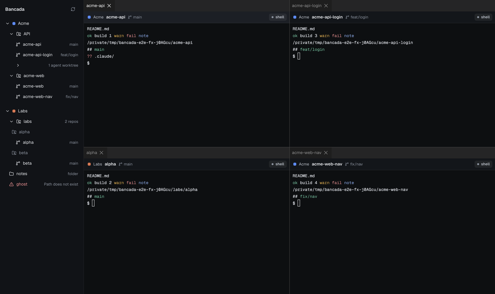

# Bancada architecture

Bancada is a macOS app where any terminal from any git worktree, project or product can sit side by side, with files and diffs in a side panel and a phone companion that tells you when an agent needs you. It does not reimplement coding agents: Claude Code, Codex and plain shells run as they are.

This document is the contract between the parts. Change it in the same PR that changes the behavior.

## Processes

| Process | Owns | Restart kills terminals? |
|---|---|---|
| **pty-host** | PTYs, per-session headless mirror and scrollback. No product logic. Changes rarely. | It *is* the thing holding terminals. Restarting it is the only event that ends live sessions. |
| **server** | HTTP/WebSocket API for the phone (PWA) and, later, git/worktrees, agent state, notifications, CLI API. Client of pty-host. | No |
| **desktop** (Electron main + renderer) | UI only. Main process is a pty-host client (direct in F0; may move behind the server later). | No |
| **cli** (later) | Commands for the user, agents and hooks. | No |

### pty-host runtime (decided)

- The pty-host always runs under **Electron's binary in node mode** (`ELECTRON_RUN_AS_NODE=1`), in production and in tests. Tests get the binary path from `require('electron')`. It never runs under system Node, whose version the user can change.
- It is bundled (esbuild, `packages/pty-host/scripts/build.mjs`) into a single CommonJS file with node-pty external, and `prepareRuntime(dataDir)` copies it, together with node-pty (`package.json`, `lib/`, the platform prebuilds), to `<dataDir>/runtime/pty-host-<version>/` before launch. `<version>` is `<package version>-<first 10 hex of sha256(bundle + node-pty version)>`, so a rebuilt bundle gets its own dir and a running host keeps executing (and keeps `pty.node` mapped from) files nobody rewrites. The dir is assembled aside and renamed into place. Old runtime dirs are not collected yet.
- `prepareRuntime` also sets the exec bit on node-pty's `spawn-helper`: the package manager unpacks it as `0644`, and node-pty then fails with `posix_spawnp failed`.
- It is launched detached (`detached: true`, `stdio: 'ignore'`, `unref()`, `ELECTRON_RUN_AS_NODE=1`), so it outlives the app. `ensureHost()` connects, or launches once and polls until it connects; concurrent calls share one launch, and a second host started by someone else exits on the pid lock while everybody connects to the first.
- The host logs to `<dataDir>/logs/pty-host.log` (lifecycle, ids, sizes and timings; never terminal input or output, command lines or environment values).
- The data dir and socket rules live in `@bancada/protocol/paths` (node-only, so the browser-safe `@bancada/protocol` entry does not import them); `apps/desktop/src/main/data-dir.ts` re-exports them.
- node-pty is used through its N-API prebuilt binary. Nobody runs `electron-rebuild` / `install-app-deps` against it. If a rebuild ever becomes unavoidable, it targets Electron, because Electron is the only runtime that loads it.
- The test runner (Vitest, system Node) only acts as a **client**: it imports the pure-JS client and spawns the host through the Electron binary.

## Data dir and profiles

- `BANCADA_PROFILE` selects the profile (default `default`; dev builds use `dev`). Data dir: `~/Library/Application Support/Bancada/<profile>`.
- `BANCADA_DATA_DIR` overrides the data dir. **Tests always use `fs.mkdtemp` under `/tmp`**, never a real profile and never a path inside the repo or a worktree (socket path limit, below).
- Electron calls `app.setPath('userData', dataDir)` before `ready`, so the single-instance lock, Chromium data and the pty-host socket all live per profile. A dev build can run next to the stable app without touching its sessions.
- pty-host socket: `<dataDir>/pty-host.sock`, mode `0600`. macOS limits `sun_path` to 104 bytes: if the path is 100 bytes or longer, use `/tmp/bancada-<uid>/<first 12 hex of sha1(dataDir)>.sock` (dir mode `0700`).
- pty-host pid/lock file: `<dataDir>/pty-host.pid`, created atomically (temp file + hard link). A second host for the same data dir refuses to start: it logs the holder's pid, prints a message to stderr and exits with code 3. A pid file whose process is gone (or whose pid now belongs to a program that is not a pty-host) is stale and replaced, together with a leftover socket file.
- Private fixtures (real session recordings) live in `~/Library/Application Support/Bancada/fixtures/` and **never** enter the repo. CI uses committed synthetic fixtures.

## Session environment hygiene

The host is often launched from a shell that belongs to another terminal app or agent session, so its own environment is contaminated. The session environment is built **at spawn time**:

1. Start from the host's environment.
2. Remove: `ORCA_*`, `CLAUDECODE`, `CLAUDE_CODE_*`, `CLAUDE_PID`, `CLAUDE_EFFORT`, `TERM_PROGRAM`, `TERM_PROGRAM_VERSION`, `VSCODE_*`, `ITERM_*`, `GHOSTTY_*`, `KITTY_*`, `WEZTERM_*`, `TMUX`, `TMUX_PANE`, plus the host's own `ELECTRON_RUN_AS_NODE`, `BANCADA_APP_VERSION` and `BANCADA_DATA_DIR` (a session that inherited the first would turn every Electron app started from the terminal into a plain Node process; the last would pin a Bancada started inside a session to the host's data dir, because it overrides the profile).
3. Set: `TERM=xterm-256color`, `COLORTERM=truecolor`, `TERM_PROGRAM=Bancada`, `TERM_PROGRAM_VERSION=<app version>` (the host reads it from `BANCADA_APP_VERSION`, set by the launcher), `LANG=en_US.UTF-8` if `LANG` is unset, `BANCADA_SESSION_ID`, `BANCADA_PROFILE`.
4. Apply `spec.env` last.

Default command: the user's login shell (`$SHELL`, falling back to `os.userInfo().shell`) with `-l`, so PATH and the user's rc files load even when the app was started from Finder.

## pty-host protocol v1

Types live in `packages/protocol/src/pty.ts`.

**Transport.** Unix socket, length-prefixed frames: `u32be length | u8 kind | payload`, where `length` counts `kind + payload`.

| kind | Direction | Payload |
|---|---|---|
| 1 `Control` | both | UTF-8 JSON: a `ClientRequest` or a `HostMessage` |
| 2 `Output` | host → client | `u8 idLength`, session id (ASCII), raw output bytes |
| 3 `Input` | client → host | `u8 idLength`, session id (ASCII), raw input bytes |

Binary frames carry terminal I/O so output never pays for base64 or JSON.

**Semantics.**

- `hello` comes first. The host replies with `protocol`, `hostVersion`, `pid`, `startedAt`. On a major protocol mismatch the client reports an error and **never** kills the host (that would kill every session).
- `attach(id)` streams a session to this connection. The host takes a cutoff: output that arrived before the cutoff is in the snapshot, output after it is streamed. Implementation: on attach, start buffering this session's output for this client, call `headless.write('', cb)`, and inside `cb` (all pre-cutoff data parsed) serialize the mirror with `SerializeAddon` (scrollback up to the requested lines), reply with the snapshot, then flush the buffer and stream live. No gaps, no duplicates. While a client is buffering, coalesced flushes skip it; before the reply the coalescer is flushed to the clients that are already streaming. The client library holds output that arrives in the same chunk as the snapshot reply until the caller's continuation has run, so `onData` never fires before the snapshot is in the caller's hands.
- `detach(id)` stops streaming that session to this connection. The renderer only attaches sessions that are visible.
- Output to clients is coalesced per session: flush at most every 8 ms or at 64 KiB. After an idle period the first chunk goes out at once (no timer delay for a keystroke echo); the rest of a burst is batched. A client that stops reading (more than 64 MiB queued) is disconnected; its sessions are unaffected. The mirror's parse backlog is bounded: the pty is paused above 4 MiB unparsed and resumed below 1 MiB.
- Many clients may attach the same session. All receive output and any can write.
- `resize` applies to the pty immediately and the last one wins; the mirror resizes after the output already received has been parsed, so every byte is interpreted at the size it was written for. Clients send a resize when they gain focus or start typing, so the size follows the last active client (desktop or phone).
- When the process exits, the host keeps the session (`state: 'exited'`, exit code, final snapshot) until `dispose`, and broadcasts `session-exited`.
- Title changes from the terminal (OSC 0/2) are broadcast as `session-title`. Claude Code writes its topic there.
- `kill` sends the signal (default `SIGHUP`) to the session's process. `dispose` kills a running process (`SIGHUP`, then `SIGKILL` after 3 s), frees the mirror and broadcasts `session-removed`.
- The host never exits on its own while sessions are alive. `shutdown` without `force` is refused (`sessions_alive`) while sessions are *running*; exited sessions kept for their snapshot do not count. With `force` it sends `SIGHUP` to every session, `SIGKILL`s whoever is still alive after 1 s, disposes everything, removes the socket and pid files and exits. `SIGTERM` and `SIGINT` do the same as a forced shutdown; `SIGHUP` is ignored. An uncaught exception is logged and the host keeps running, because dying would end every terminal.
- Persistence (F1): metadata in `<dataDir>/sessions/<id>.json` plus a periodic snapshot, so after a host restart sessions show as `lost` with their last screen and a resume command.

## Renderer terminals

- xterm.js **6.0.0 stable** in `packages/ui` (`TerminalView`), with exactly pinned addons: `@xterm/addon-webgl` 0.19.0, `addon-fit` 0.11.0, `addon-unicode11` 0.9.0, `addon-web-links` 0.12.0; `@xterm/addon-serialize` 0.14.0 and `@xterm/headless` 6.0.0 on the host side. No beta channels: addon majors must match the core.
- `TerminalView` knows nothing about Electron: it takes a `connect` function that returns a `TerminalLink` (snapshot, output and event subscriptions, `write`, `resize`, `close`). The desktop implements it over a MessagePort; the phone will implement it over a WebSocket.
- Attach order: create the terminal at the snapshot's size, write the snapshot, then fit to the container and send the resize. Fit is skipped while the container is 0x0. The view sends a resize when it connects, when its container changes size, and on focus or first typing after focus (last active client wins). Shift+Enter sends `ESC CR` (Claude Code's newline); the swallowed `keypress` would otherwise send a plain CR.
- Visible panes attach, hidden panes detach (a tab behind another one, via dockview's visibility event) and re-attach with a fresh snapshot (`reset()` + write). An attach asks for **2000 lines** of scrollback (about 4 ms to serialize against 30 ms and more for 10,000); the full history is a later, on-demand feature.
- **WebGL budget** (`WebglBudget` in `packages/ui`): Chromium keeps about 16 live contexts per page, and each costs GPU memory, so only the N most recently active visible terminals (focused first) use WebGL and the rest use the DOM renderer. A lost context falls back to the DOM renderer and is not retried. N and the default are set by the F0 terminal-grid proof, [docs/proofs/F0-a.md](proofs/F0-a.md).

The board with four live shells (generic e2e fixture, captured by `apps/desktop/e2e/visual.spec.ts`): 

### Main to renderer data path

- Main owns one connection to the pty-host and keeps **one host attachment per session**: a second attach from the same connection replaces the first and fails with a misleading `invalid_request`. It fans the output out to one `MessageChannelMain` port per renderer view (`apps/desktop/src/main/terminal-hub.ts`).
- Per view: `attach(sessionId, viewId, { scrollback })` over IPC; main creates the channel, registers the view, attaches (or restarts) the host attachment, posts the snapshot as the first port message, then transfers the port to the page (`webContents.postMessage`). A port cannot cross `contextBridge`, so the preload forwards it with `window.postMessage` and `src/renderer/src/terminal-link.ts` matches it to the `attach` call by `viewId`.
- Output is a bare `Uint8Array` per message (no JSON, no base64). Main copies each chunk into a tight array first: the host client hands out slices of larger socket buffers, and structured clone would serialize the whole backing buffer. (`MessagePortMain` only transfers ports, so the bytes are copied once per view.)
- A view that joins a session already attached restarts the host attachment (`detach`, `attach`) and every view of that session gets the new snapshot first (the views already open redraw): no gap, no duplicate. The last view to leave detaches the host attachment. A view detached while its attach is still in flight is handled (the view is registered before anything asynchronous).
- Keystrokes and resizes go as fire-and-forget IPC (`ipcRenderer.send`). `session-exited` reaches the views as a port message and every window as an event; if the host connection drops, views get `closed` and show the ended state.
- A panel keeps its `sessionId` in the saved board. On restore it attaches by id: a session that is gone (`not_found`) shows "sessão encerrada" instead of a terminal, and an error boundary wraps every panel.

## Workspace config and discovery

`packages/workspace` (`@bancada/workspace`, Node only) owns the config file and the scan of the machine.

- Config: `~/.config/bancada/config.toml`, or the file named by `BANCADA_CONFIG` (tests). A generic example is `docs/config.example.toml`. Model: `[[products]]` (`id`, `name`, `color`, `projects = [{ path, name? }]`) and `[options]` (`worktreeRoot`, `collapsedWorktrees` globs, default `**/.claude/worktrees/**`). Paths are absolute or start with `~/`. A missing file is an empty workspace, an invalid one is reported to the UI; neither crashes the app.
- Discovery, per project path: a git repo (has `.git`) lists its worktrees from `git worktree list --porcelain` (path, branch, head, detached, locked, prunable); a non-git folder holding repos up to 2 levels deep (hidden folders and `node_modules` skipped, never searching inside a repo) is a **group** of repos; any other folder is a plain **folder**. Each worktree is `main` (first record), `ephemeral-agent` (path under `.claude/worktrees/`) or `regular`, and `collapsed` when it matches a collapsed glob. A failure is reported on the project (`kind: 'error'`) or on the repo (`error`), never thrown for the whole tree.
- `pnpm --filter @bancada/workspace import-orca [--write]` prints a suggested config from `orca repo list`; `--write` creates the file only if it does not exist. `pnpm --filter @bancada/workspace discover [--orca | <path>...]` prints read-only counts per project.

## Desktop process boundary and boards

- The renderer is sandboxed (`sandbox: true`, `contextIsolation: true`, `nodeIntegration: false`). The only bridge is `src/preload/index.ts` (built as CommonJS, which a sandboxed preload requires), exposing `window.bancada` with `discoverWorkspace()`, `loadBoard(id)`, `saveBoard(id, board)` and the terminal calls `spawn`, `list`, `attach`, `write`, `resize`, `detach`, `kill` and `onSessionEvent`. Types live in `apps/desktop/src/shared/api.ts`; main only answers IPC from its own window.
- A board is dockview's `toJSON()` layout wrapped as `{ version: 1, layout }` and stored at `<dataDir>/boards/<id>.json` (atomic write, board ids restricted to `[A-Za-z0-9_-]`). The renderer saves 300 ms after a layout change and restores on start; the first board is `default`.
- Layout uses `dockview-react` 8.4.1 (MIT packages only; never `dockview-enterprise`). Sidebar items are HTML5 drags with the custom type `application/x-bancada-worktree` (a click opens one next to the active panel); the board accepts them through dockview's `onUnhandledDragOver` and, from `onDidDrop`, spawns a shell session (cwd = the worktree path) and places the new panel (edge = split, center = tab). Closing a panel does not end its session in F0.
- The pty-host bundle and node-pty come from the workspace in dev, e2e and bench (`apps/desktop/src/main/host.ts`: the built `packages/pty-host/dist/pty-host.cjs`, and the node-pty that package resolves, both overridable with `BANCADA_PTY_HOST_BUNDLE` and `BANCADA_NODE_PTY_DIR`); `prepareRuntime` copies them into the data dir. Packaged builds will point them at app resources.

## Phone

`packages/server` (`@bancada/server`) is the phone's side: a Node `http` + `ws` server bundled with esbuild and run under Electron's node mode like the host (`pnpm --filter @bancada/server start`). It is a client of the pty-host through `ensureHost`/`PtyClient`: one long-lived "monitor" connection (list, lifecycle events, and an attach with scrollback 0 on every running session to watch for BEL), plus **one connection per phone WebSocket**, because a connection keeps a single attach callback per session and the attach cutoff is what guarantees no gap and no duplicate between snapshot and stream. `apps/mobile` is the PWA the server serves.

- **Listeners.** The public API binds `127.0.0.1:${BANCADA_SERVER_PORT:-7655}` only. The phone reaches it through `tailscale serve` (HTTPS on the tailnet, nothing on the public internet, never `funnel`). Because `tailscale serve` proxies from localhost, a request coming from localhost is **not** a trust signal. The local control API is HTTP on a Unix socket `<dataDir>/server.sock` (mode `0600`, same `sun_path` fallback rule as the host, `/tmp/bancada-<uid>/<12 hex>-server.sock`): pairing codes, device list/revoke, notify, status. The CLI (`pair`, `devices`, `revoke`, `notify`) uses it.
- **Pairing and auth.** `pair` asks for a one-time code (8 Crockford base32 characters, 5 minutes, single use, memory only; failed attempts limited globally to 5 per minute). `POST /api/pair` returns a device token in the cookie `__Host-bancada_device` (`HttpOnly; Secure; SameSite=Strict; Path=/`); `<dataDir>/devices.json` (`0600`) keeps only its sha256, a name and created/last-seen. Every `/api` request and WebSocket upgrade needs the cookie; state-changing requests and upgrades also need `Sec-Fetch-Site: same-origin` or an `Origin` equal to `X-Forwarded-Host`/`Host`. A request target that is not a plain origin-form path (`//…`, `*`) or has a malformed percent-escape in the session id gets `400`, before authentication for the former; a bad request never throws out of the HTTP or upgrade handler. The PWA shell is public. Revoking a device closes its sockets at once (code 4401) and drops its push subscription.
- **API.** `GET /api/sessions` (title, folder name, state, size, times: no pid, command, env or full path), `GET /api/sessions/<id>/stream` (WebSocket): a JSON `snapshot` (scrollback 500, the session's own cols and rows), then binary live output, JSON `title`/`exit`; the phone sends `{type:'input', data}` (at most 16 KiB) and nothing else. There is no resize from the phone in F0 (the PWA renders the session at its size, scaled to the screen width) and no kill, dispose or spawn route.
- **Web Push.** VAPID keys are generated once; the private key lives in the macOS Keychain (service `Bancada`, account `vapid-<profile>`, written through `security -i`), or in a `0600` file named by `BANCADA_VAPID_FILE` (tests). Subscriptions are in `<dataDir>/push.json` (`0600`, one per device). Triggers in F0: a BEL in a session's output, debounced to one per 30 s per session (a BEL that terminates an OSC string, such as a title, does not count), and `notify` through the control socket. The payload is `{title, body, url, tag}`: title = session title or cwd basename, never terminal content, `url` = `/#/s/<id>`.
- **Proofs and runbook:** `docs/proofs/F0-d.md` (iPhone over Tailscale) and `F0-e.md` (Remote Control).

## Secrets and personal data

Never in the repo: device tokens, VAPID private keys, Notion tokens, the user's `~/.config/bancada/config.toml`, session recordings. Secrets go to the macOS Keychain. CI runs a secret scan on every push.
