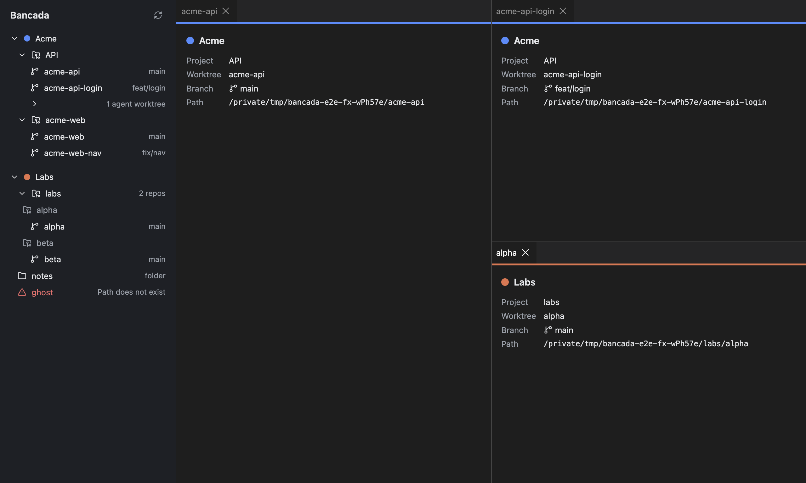

# F0 proof (c): drag a worktree to a pane edge, save and restore the layout

**Result: passed.** A worktree dragged from the sidebar onto a pane edge splits the board; panels can be moved and re-split with dockview's own drag and drop; the layout is saved to `<dataDir>/boards/default.json` and comes back identical after quitting and relaunching.

The screenshot uses only generic fixture data (Acme and Labs products over temp git repos).

## What was built

- `packages/workspace`: config (`~/.config/bancada/config.toml`, `BANCADA_CONFIG` for tests, smol-toml) and discovery (git repo, group of repos up to 2 levels deep, plain folder; worktrees classified `main`, `regular`, `ephemeral-agent`; errors reported per project). See "Workspace config and discovery" in `ARCHITECTURE.md`.
- `apps/desktop`: sandboxed renderer (`sandbox`, `contextIsolation`, no `nodeIntegration`) with a typed preload bridge (`window.bancada`: `discoverWorkspace`, `loadBoard`, `saveBoard`); sidebar product > project > worktree; `dockview-react` 8.4.1 board.
- Neutral styling through CSS custom properties; Lucide icons. No design pass (F1).

## How the drag works

Sidebar rows are native HTML5 drags carrying `application/x-bancada-worktree`. The board accepts them in dockview's `onUnhandledDragOver` (which turns on its edge overlays) and reads the drop in `onDidDrop`: an edge of a group splits it (`left`, `right`, `above`, `below`), the center adds a tab, and the empty board gets its first panel. The placeholder panel shows product color, project, worktree name and branch. Saving is debounced (300 ms) after `onDidLayoutChange`; restore runs once on start, and nothing is written before the restore attempt finishes.

## Evidence

Playwright `_electron` e2e (`pnpm --filter @bancada/desktop e2e`, 4 tests), with `BANCADA_DATA_DIR` and the fixture under `/tmp` and `BANCADA_CONFIG` pointing at a temp config. The fixture has two repos with linked and agent worktrees, a non-git folder holding two repos (one nested a level down), a plain folder and a path that does not exist.

| Test | Checks |
|---|---|
| sidebar | 2 products; repo worktrees with branches; agent worktree collapsed until expanded; group with 2 repos; plain folder; missing path shown as an error without breaking the rest |
| split and restore | drop on the empty board gives 1 panel; real mouse drag to the right edge of the first panel gives 2 groups side by side (same top, second starts at the first's right edge); drag to the bottom edge of the second gives 3 groups (third under the second, same left); placeholder shows product color, project, worktree and branch; saved JSON grid is `HORIZONTAL[leaf, VERTICAL[leaf, leaf]]` with 3 panels; after `app.close()` and relaunch the panel ids, the grid structure, the panel texts and the group positions (within 3 px) are equal |
| re-split | dragging a panel's tab (dockview's own DnD) to the left edge of another group rebuilds the layout as 3 groups in a row with that panel leftmost, and the saved JSON follows |
| smoke | window title, own data dir, empty state without a config |

Runs:

- 3 consecutive `pnpm --filter @bancada/desktop e2e` runs (each rebuilds): 4 of 4 passed every time (7.5 s, 8.1 s, 6.5 s).
- `playwright test layout.spec.ts --repeat-each=12`: 36 of 36 passed.
- An earlier run exposed one flaky assertion in the re-split test (it read the saved JSON while the debounced save still held an intermediate layout). The test now polls for the final grid outline (`H[L,L,L]`, `H[L,V[L,L]]`) instead of an intermediate one. This was a test race, not an app bug.
- No Electron process from these runs was left behind (`pgrep` for the worktree path returns nothing) and no `/tmp/bancada-e2e*` directory remains.

Unit tests (`pnpm test`): 59 passed in 14 files, among them real temp git repos for discovery (`git init`, commit, `git worktree add`, lock, prune, detached, groups, errors), config parsing, the Orca list parser and the never-overwrite rule, board save/load.

## Real-machine sanity run (read-only)

Discovery was run over the repos listed by `orca repo list` (5 repos, counts only, nothing recorded here that identifies a repo): every project resolved as a repo, 0 errors. Worktrees by kind per repo (main / regular / ephemeral-agent): 1/3/0, 1/8/18, 1/0/0, 1/0/0, 1/0/0. 10 worktrees in one repo were locked; none were prunable.

## Limits and notes

- The renderer sets no Content Security Policy yet (the dev server needs inline scripts for hot reload). F1 should add one for production builds.
- If a saved board cannot be restored by dockview, the app starts empty and the next change overwrites the file. A backup of the previous file is a F1 item.
- Dragging a plain-folder project is allowed too (it opens a placeholder with no branch); F1 decides what a folder panel becomes.
- Panels are placeholders. Terminals attach in F1.
