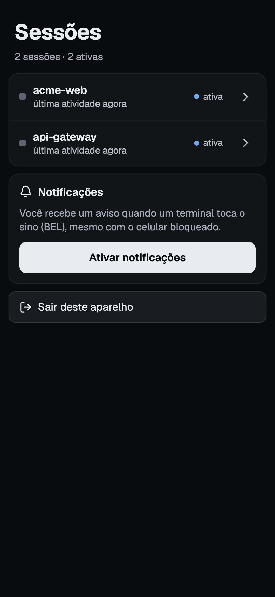

# F0 proof (d): phone PWA over Tailscale, with push while locked

**Result: pending the user's phone (Chrome on a Galaxy S25+).** Everything that can be proven on the Mac is proven and measured below: the server, pairing, cookie auth, revocation, the PWA in Chromium with an Android profile, the offline shell that opens with Tailscale off, the Web Push send path against a fake push service that verifies the VAPID JWT and decrypts the payload, and the real `tailscale serve` path called from the Mac itself. What no test here can show is Google's push service (FCM) delivering to a locked phone, and the delay of that hop. The exact steps to finish are in [On the phone](#on-the-phone).

Other screens: [pairing](assets/F0-d-pair.png), [session view](assets/F0-d-session.png), [Tailscale off](assets/F0-d-offline.png). All of them use temp data (`acme-web`, `api-gateway`), captured at 384x832 CSS px (the S25+ screen, 1080x2340 at a scale factor of 2.8125) by the e2e test.

## What was built

- `packages/server` (`@bancada/server`): Node `http` + `ws` server, bundled with esbuild and launched like the pty-host, under Electron's binary in node mode (`pnpm --filter @bancada/server start`). It is a client of the pty-host through `ensureHost`/`PtyClient`.
  - Public API on `127.0.0.1:${BANCADA_SERVER_PORT:-7655}` only (never `0.0.0.0`): the PWA shell, `POST /api/pair`, `GET /api/me`, `GET /api/sessions`, `GET /api/sessions/<id>/stream` (WebSocket), push key/subscribe/unsubscribe, `POST /api/logout`.
  - Local control API on `<dataDir>/server.sock` (mode 0600, same `sun_path` fallback rule as the host): pairing codes, device list/revoke, notify, status. CLI: `pair`, `devices`, `revoke <id>`, `notify -- "<text>"`.
- `apps/mobile`: React + Vite PWA (manifest, icons, service worker), xterm.js 6.0.0 read view scaled to the screen width, quick keys, input bar, "Ativar notificações". Visual direction from `Phone.dc.html`: tokens as CSS custom properties, Geist fonts self-hosted, Lucide icons.
- The service worker (`apps/mobile/src/sw.js`, filled in by the build) handles `push` and `notificationclick`, and keeps an offline copy of the shell: the build writes the list of its own files and a hash of them into the worker, the worker caches that list when it installs and drops older caches when it activates. Navigations go to the network first (5 s limit) and fall back to the cached shell when there is no answer or the answer is a 5xx; built files come from the cache. `/api` is never cached or intercepted.
- When the Mac is out of reach the app says why and keeps trying every 3 s (and at once when the page becomes visible again):
  - no answer at all (Tailscale off, Mac asleep): "Ligue o Tailscale";
  - the tailnet answers but the server behind `tailscale serve` is stopped (502): "O Bancada está parado no Mac".
  
  So a notification tapped with Tailscale off opens the app on that screen, and turning Tailscale on is enough to land on the session.

## Security model

The phone gets a shell on the Mac as the user (it can type into any session), so the model is built in layers, and the server never trusts the network position of a request.

| Layer | What it does |
|---|---|
| Network | The server listens on loopback only. The phone reaches it through `tailscale serve` (HTTPS with a tailnet certificate, only devices of the tailnet). Nothing is on the public internet: never use `tailscale funnel`. |
| Not a trust signal | `tailscale serve` proxies every tailnet request from `127.0.0.1`, so "comes from localhost" proves nothing. Every API and WebSocket request needs a valid device cookie; there is no localhost exemption (tested with `Host: localhost`, `Origin: http://localhost`, `X-Forwarded-For: 127.0.0.1`: all 401). Only the PWA shell (public code, no data) and `POST /api/pair` are reachable without a cookie. |
| Pairing | `pair` asks the control socket for a one-time code: 8 characters (Crockford base32, 40 bits), valid 5 minutes, single use, kept in memory only. Failed attempts are limited globally (5 per minute, then even a right code gets 429 until the window passes), because every request looks like it comes from one address. |
| Device token | 32 random bytes, delivered once in a cookie `__Host-bancada_device`: `HttpOnly; Secure; SameSite=Strict; Path=/`, no Domain. The server keeps only its sha256 in `<dataDir>/devices.json` (0600) with a name, `createdAt` and `lastSeenAt`. The token is not in the response body, and JavaScript cannot read it. |
| Cross-site | State-changing requests and WebSocket upgrades need `Sec-Fetch-Site: same-origin`, or an `Origin` equal to `X-Forwarded-Host`/`Host`. A missing or foreign origin is 403. This is defense in depth on top of SameSite=Strict. |
| Revocation | `revoke <id>` (or `logout` from the phone) removes the device, closes every open socket of that device (close code 4401, under 1 s; each socket's host connection is closed with it) and drops its push subscription. The cookie is dead for new requests at once. |
| What the phone can do | List sessions, attach, type. No resize (the session keeps its own size), and no kill, dispose or spawn exists in the API at all (404, and a test asserts the fake host never received such a call). Input per message is capped at 16 KiB. The list shows title, folder name and times, not pid, command line, environment or full path. |
| Push | VAPID private key in the macOS Keychain (service `Bancada`, account `vapid-<profile>`, written through `security -i` so it never shows in `ps`). The payload carries a title, a fixed body and a URL, never terminal content. |
| Control socket | Mode 0600 in the data dir (or `/tmp/bancada-<uid>/`, mode 0700): whoever can open it is the user. Not reachable over TCP. |

Accepted risks: a paired phone that is stolen and unlocked can type into sessions until you revoke it (`devices`, `revoke`); anyone on the tailnet can reach the pairing endpoint but needs a live code, and can block pairing for a minute by guessing wrongly; the PWA shell is served without auth.

## Verified on the Mac

Commands: `pnpm check` (typecheck, lint, test, build), then `pnpm --filter @bancada/mobile e2e`.

- `pnpm test`: the server has 62 tests in 6 files, the mobile logic 7.
  - Unit: pairing expiry (at the exact instant), single use, 5-per-minute limit, 5 outstanding codes; device store (sha256 only, 0600, restart, revoke, prefix ids); cookie flags and the cookie-less 401 on every route; CSRF/origin checks; revocation closing sockets; BEL detector (OSC title terminators do not ring, split chunks, DCS/APC, unterminated strings) and 30 s debounce; push payload; malformed request targets get 400 instead of crashing the server.
  - Integration against a real pty-host launched through Electron's node mode on a `mkdtemp` dir: list, attach (snapshot with scrollback 500 contains history that is not replayed on the stream), input echo over WS, two phones on one session, the phone cannot resize the pty, BEL pushes (OSC title does not), a second BEL inside 30 s does not, `notify` through the control socket, and the server reconnecting (relaunching the host) after the host is killed.
  - Push send path: a fake push service on `https://127.0.0.1` verifies the VAPID JWT (ES256 signature against `k`, `aud` = endpoint origin, `exp` within 24 h, `sub` is `mailto:`/`https:`), then decrypts the aes128gcm payload with the subscription's keys using an RFC 8291 implementation written independently of `web-push`. A 410 answer removes the subscription; a 500 does not.
  - The real Keychain path (add, read back, reuse, delete a throwaway account) runs locally and is skipped on CI.
- e2e (`pnpm --filter @bancada/mobile e2e`, Playwright Chromium in new headless mode, Galaxy S24 user agent with the S25+ screen, 384x832 at 2.8125, notifications granted, 6 tests):
  - pairs with a wrong code (refused), then a real one; the cookie is HttpOnly, Secure, SameSite=Strict and invisible to `document.cookie`;
  - lists 2 sessions, and offers "Ativar notificações" in the tab (Chrome on Android does not need the app installed for push);
  - opens a session: the 100x30 terminal is scaled to 0.3 to 1.0 of its natural width and fills the screen width within 1.5 px; types text and sees the echo; quick keys `2` and `Ctrl C` work; the pty is still 100x30;
  - **Tailscale off:** the worker has the shell cached once it is ready; with every connection to the proxy dropped, a fresh navigation to a push URL (`/#/s/<id>`) opens the app on "Ligue o Tailscale"; when the network comes back, the session opens by itself, live, with its screen. With the proxy answering 502 (server stopped), a reload shows "O Bancada está parado no Mac" and recovers the same way. A run with the worker's fetch handler disabled fails at that navigation with `net::ERR_CONNECTION_RESET`, so the test does depend on the offline copy;
  - revoking the device while viewing sends the phone back to the pairing screen;
  - no horizontal overflow, every button/input at least 44 px, console clean (the only filtered messages are the 401 responses the flows provoke, and the failed loads of the Tailscale-off test).
  
  The e2e puts a TLS proxy in front of the server to play the part of `tailscale serve`. Chromium refuses to register a service worker over its self-signed certificate even with `ignoreHTTPSErrors`, so the config launches it with `--ignore-certificate-errors`; the headless shell has no notifications at all, so the config uses the full Chromium build (`channel: 'chromium'`).
- `tailscale serve` from the Mac itself (Tailscale 1.104.1, a throwaway server on a `mkdtemp` data dir and file VAPID key, `tailscale serve --bg 7655`, then requests to `https://<mac>.<tailnet>.ts.net`): the shell answers 200; `/api/me` without a cookie 401; `POST /api/pair` with `Origin` set to the tailnet URL and no `Sec-Fetch-Site` is accepted as same origin (it got `invalid_code` for a wrong code, not `bad_origin`), so the proxy forwards the host the way `isSameOrigin` expects; the real code with `Sec-Fetch-Site: same-origin` returns 200 and the `__Host-bancada_device` cookie; `/api/me` with it 200. A WebSocket to a fresh `/bin/sh` session through the same URL opened in 28 ms, took the snapshot and echoed typed input. The very first HTTPS request after `serve` was turned on timed out once (the tailnet certificate was being issued) and every later one answered at once.

Measured on this Mac (localhost, so these are the local costs; the network and FCM are what the phone run adds):

| What | Result |
|---|---|
| WS `input` to echoed output | 10 ms |
| BEL typed in a session to the push request arriving at the fake endpoint (detect, encrypt, sign, POST) | 15 ms |
| WebSocket open through `tailscale serve` (Mac to itself) | 28 ms |
| PWA bundle | about 800 KB on disk (index 246 KB, xterm 329 KB, fonts self-hosted), all of it in the offline copy |

## On the phone

Pending: the user's Galaxy S25+, in Chrome (not Samsung Internet). Do this once, in order.

1. **Tailscale.** Mac and phone signed in to the same tailnet, with MagicDNS and **HTTPS Certificates** on (admin console, DNS page).
2. **One profile for both sides.** The phone sees the sessions of the pty-host the server talks to, which is the one of its profile. `pnpm dev` runs the desktop app with profile `dev`, so run every server command below with the same profile: `export BANCADA_PROFILE=dev` in that terminal first.
3. **Start the desktop app and the server** on the Mac: `pnpm dev`, and in another terminal (with the export) `pnpm --filter @bancada/server start`. Wait for the line `ready`. Open a terminal pane or two in the app.
4. **Expose the server to the tailnet only:** `tailscale serve --bg 7655`, then `tailscale serve status` shows `https://<mac>.<tailnet>.ts.net (tailnet only)` proxying to `127.0.0.1:7655`. Never `tailscale funnel`. (If you changed `BANCADA_SERVER_PORT`, use that port.) `tailscale serve reset` undoes it.
5. **Pair:** on the Mac, `pnpm --filter @bancada/server pair` prints a QR, a URL and a code (`ABCD-EFGH`, 5 minutes, single use). With Tailscale on in the phone, scan the QR with the camera (it opens Chrome on the pairing screen with the code filled in) or open `https://<mac>.<tailnet>.ts.net` in Chrome and type the code. The sessions list appears.
6. **Install (recommended):** Chrome menu, "Adicionar à tela inicial", "Instalar". Open Bancada from the new icon. On Android the installed app runs on Chrome's storage, so it should still be paired; if it shows the pairing screen instead, pair again inside it and note that here.
7. **Enable notifications:** tap "Ativar notificações" and allow. On Samsung, also set Chrome's battery use to unrestricted (Configurações, Apps, Chrome, Bateria, "Sem restrições"); otherwise One UI may put Chrome to sleep and hold pushes back.
8. **Check the basics:** open a session, type a command and see the echo, tap the quick keys.
9. **Measure the push:** lock the phone. On the Mac, in a Bancada pane, run `sleep 5; printf '\a'` and start a stopwatch when the 5 s are over. Stop it when the notification lights the lock screen. Repeat 5 times, waiting 35 s between runs (the bell is debounced to one per 30 s per session). `pnpm --filter @bancada/server notify -- "teste"` sends a push without the debounce.
10. **Tailscale off:** turn Tailscale off on the phone and send `notify -- "teste"`. The notification still arrives: push goes through Google's push service, not the tailnet. Tap it: the app opens on "Ligue o Tailscale". Turn Tailscale on from the quick settings tile: the app connects by itself within a few seconds.
11. **Revoke:** `pnpm --filter @bancada/server devices` lists the phone, `pnpm --filter @bancada/server revoke <id>` removes it. The app must fall back to the pairing screen at once. Pair again if you keep using it.

Record here: the 5 delays (the F3 acceptance target is a push within 10 s with the phone locked), whether the push arrived with Tailscale off, and whether the installed app stayed paired.

## Notes and deviations

- The pairing cookie is `__Host-bancada_device`. The app still has the iOS branch (push only after "Adicionar à Tela de Início", pairing inside the installed app), but iOS is not a target and is not tested.
- The Enter after the text of the input bar is sent 60 ms after the text, so a TUI reads typing, not one paste. Not yet tried against Claude Code on a phone.
- The default VAPID subject is the repository URL (`https://github.com/vitorf91/bancada`); FCM accepts it. Override with `BANCADA_VAPID_SUBJECT`.
- Environment variables: `BANCADA_PROFILE`, `BANCADA_SERVER_PORT`, `BANCADA_VAPID_FILE` (file store instead of the Keychain, for tests), `BANCADA_VAPID_SUBJECT`, `BANCADA_PUBLIC_URL` (what `pair` prints; otherwise the tailnet name from `tailscale status`), `BANCADA_PWA_DIR`.
