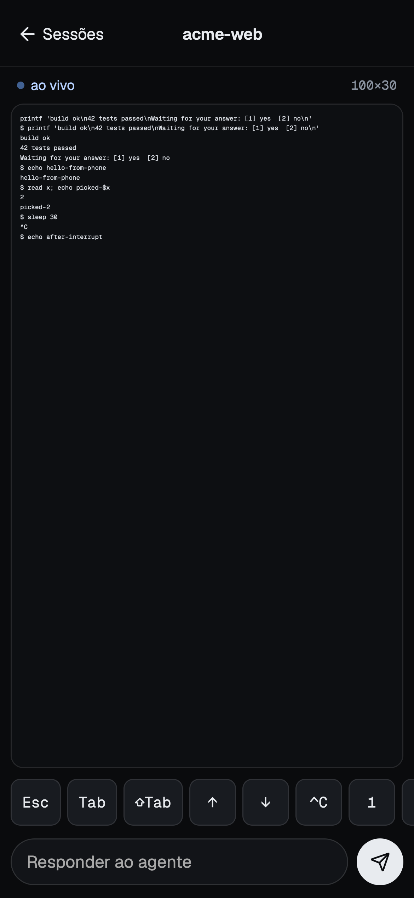

# F0 proof (d): phone PWA over Tailscale, with push while locked

**Result: pending the user's iPhone.** Everything that can be proven on the Mac is proven and measured below: the server, pairing, cookie auth, revocation, the PWA in WebKit with an iPhone profile, and the Web Push send path against a fake push service that verifies the VAPID JWT and decrypts the payload. What no test here can show is Apple's push service delivering to a locked iPhone, and the delay of that hop. The exact steps to finish are in [On the iPhone](#on-the-iphone).

Other screens: [pairing](assets/F0-d-pair.png), [sessions list](assets/F0-d-list.png). All of them use temp data (`acme-web`, `api-gateway`), captured at 390x844 by the e2e test.

## What was built

- `packages/server` (`@bancada/server`): Node `http` + `ws` server, bundled with esbuild and launched like the pty-host, under Electron's binary in node mode (`pnpm --filter @bancada/server start`). It is a client of the pty-host through `ensureHost`/`PtyClient`.
  - Public API on `127.0.0.1:${BANCADA_SERVER_PORT:-7655}` only (never `0.0.0.0`): the PWA shell, `POST /api/pair`, `GET /api/me`, `GET /api/sessions`, `GET /api/sessions/<id>/stream` (WebSocket), push key/subscribe/unsubscribe, `POST /api/logout`.
  - Local control API on `<dataDir>/server.sock` (mode 0600, same `sun_path` fallback rule as the host): pairing codes, device list/revoke, notify, status. CLI: `pair`, `devices`, `revoke <id>`, `notify -- "<text>"`.
- `apps/mobile`: React + Vite PWA (manifest, icons incl. apple-touch-icon, service worker with `push` and `notificationclick`), xterm.js 6.0.0 read view scaled to the screen width, quick keys, input bar, "Ativar notificações". Visual direction from `Phone.dc.html`: tokens as CSS custom properties, Geist fonts self-hosted, Lucide icons.

## Security model

The phone gets a shell on the Mac as the user (it can type into any session), so the model is built in layers, and the server never trusts the network position of a request.

| Layer | What it does |
|---|---|
| Network | The server listens on loopback only. The phone reaches it through `tailscale serve` (HTTPS with a tailnet certificate, only devices of the tailnet). Nothing is on the public internet: never use `tailscale funnel`. |
| Not a trust signal | `tailscale serve` proxies every tailnet request from `127.0.0.1`, so "comes from localhost" proves nothing. Every API and WebSocket request needs a valid device cookie; there is no localhost exemption (tested with `Host: localhost`, `Origin: http://localhost`, `X-Forwarded-For: 127.0.0.1`: all 401). Only the PWA shell (public code, no data) and `POST /api/pair` are reachable without a cookie. |
| Pairing | `pair` asks the control socket for a one-time code: 8 characters (Crockford base32, 40 bits), valid 5 minutes, single use, kept in memory only. Failed attempts are limited globally (5 per minute, then even a right code gets 429 until the window passes), because every request looks like it comes from one address. |
| Device token | 32 random bytes, delivered once in a cookie `__Host-bancada_device`: `HttpOnly; Secure; SameSite=Strict; Path=/`, no Domain. The server keeps only its sha256 in `<dataDir>/devices.json` (0600) with a name, `createdAt` and `lastSeenAt`. The token is not in the response body, and JavaScript cannot read it. |
| Cross-site | State-changing requests and WebSocket upgrades need `Sec-Fetch-Site: same-origin`, or an `Origin` equal to `X-Forwarded-Host`/`Host`. A missing or foreign origin is 403. This is defense in depth on top of SameSite=Strict. |
| Revocation | `revoke <id>` (or `logout` from the phone) removes the device, closes every open socket of that device (close code 4401, under 1 s; each socket's host connection is closed with it) and drops its push subscription. The cookie is dead for new requests at once. |
| What the phone can do | List sessions, attach, type. No resize (the session keeps its own size), and no kill, dispose or spawn exists in the API at all (404, and a test asserts the fake host never received such a call). Input per message is capped at 16 KiB. The list shows title, folder name and times, not pid, command line, environment or full path. |
| Push | VAPID private key in the macOS Keychain (service `Bancada`, account `vapid-<profile>`, written through `security -i` so it never shows in `ps`). The payload carries a title, a fixed body and a URL, never terminal content. |
| Control socket | Mode 0600 in the data dir (or `/tmp/bancada-<uid>/`, mode 0700): whoever can open it is the user. Not reachable over TCP. |

Accepted risks: a paired phone that is stolen and unlocked can type into sessions until you revoke it (`devices`, `revoke`); anyone on the tailnet can reach the pairing endpoint but needs a live code, and can block pairing for a minute by guessing wrongly; the PWA shell is served without auth.

## Verified on the Mac

Command: `pnpm check` (typecheck, lint, test, build) green, then `pnpm --filter @bancada/mobile e2e`.

- `pnpm test`: 415 tests pass in 28 files across the repo. The server has 60 in 6 files, the mobile logic 7.
  - Unit: pairing expiry (at the exact instant), single use, 5-per-minute limit, 5 outstanding codes; device store (sha256 only, 0600, restart, revoke, prefix ids); cookie flags and the cookie-less 401 on every route; CSRF/origin checks; revocation closing sockets; BEL detector (OSC title terminators do not ring, split chunks, DCS/APC, unterminated strings) and 30 s debounce; push payload.
  - Integration against a real pty-host launched through Electron's node mode on a `mkdtemp` dir: list, attach (snapshot with scrollback 500 contains history that is not replayed on the stream), input echo over WS, two phones on one session, the phone cannot resize the pty, BEL pushes (OSC title does not), a second BEL inside 30 s does not, `notify` through the control socket, and the server reconnecting (relaunching the host) after the host is killed.
  - Push send path: a fake push service on `https://127.0.0.1` verifies the VAPID JWT (ES256 signature against `k`, `aud` = endpoint origin, `exp` within 24 h, `sub` is `mailto:`/`https:`), then decrypts the aes128gcm payload with the subscription's keys using an RFC 8291 implementation written independently of `web-push`. A 410 answer removes the subscription; a 500 does not.
  - The real Keychain path (add, read back, reuse, delete a throwaway account) runs locally and is skipped on CI.
- e2e (`pnpm --filter @bancada/mobile e2e`, Playwright WebKit, iPhone 14 profile at 390x844, 5 tests): pairs with a wrong code (refused) then a real one; the cookie is HttpOnly, Secure, SameSite=Strict and invisible to `document.cookie`; lists 2 sessions; opens one; the 100x30 terminal is scaled to 0.3 to 1.0 of its natural width and fills the screen width within 1.5 px; types text and sees the echo; quick keys `2` and `Ctrl C` work; the pty is still 100x30; revoking the device while viewing sends the phone back to the pairing screen; no horizontal overflow, every button/input at least 44 px, console clean (the only filtered messages are the 401 responses the flows provoke). The e2e puts a TLS proxy in front of the server to play the part of `tailscale serve` (WebKit does not store a Secure cookie from plain `http://localhost`). Three consecutive runs: 5 of 5 passed (5.1 s, 4.9 s, 4.8 s).

Measured on this Mac (localhost, so these are the local costs; the network and Apple's push service are what the iPhone run adds):

| What | Result |
|---|---|
| WS `input` to echoed output | 10 ms |
| BEL typed in a session to the push request arriving at the fake endpoint (detect, encrypt, sign, POST) | 15 ms |
| PWA bundle | 804 KB on disk (index 246 KB, xterm 329 KB, fonts self-hosted) |

## On the iPhone

Pending: the user's iPhone. Do this once, in order.

1. **Tailscale.** Install Tailscale on the Mac and on the iPhone and sign in to the same tailnet. In the admin console (DNS page) turn on MagicDNS and **HTTPS Certificates**.
2. **Start the server** on the Mac and leave it running: `pnpm --filter @bancada/server start`. Wait for the line `ready`. (It starts the pty-host if none is running, and builds the PWA the first time.)
3. **Expose it to the tailnet only:** `tailscale serve --bg 7655`, then `tailscale serve status` shows `https://<mac>.<tailnet>.ts.net` proxying to `127.0.0.1:7655`. Do not use `tailscale funnel`. (If you changed `BANCADA_SERVER_PORT`, use that port.)
4. **Open the app:** on the iPhone, in Safari, open `https://<mac>.<tailnet>.ts.net`. The pairing screen appears.
5. **Add to Home Screen:** Share, then "Add to Home Screen". Open Bancada **from the new icon**. Push on iOS only works for the installed app, and the installed app has its own cookie jar, so pair from inside it.
6. **Pair:** on the Mac run `pnpm --filter @bancada/server pair`. It prints a QR, a URL and a code (`ABCD-EFGH`, 5 minutes, single use). In the installed app type the code (the QR opens Safari, which is the other cookie jar; use it only to pair the browser). The sessions list appears.
7. **Check the basics:** open a session, type a command and see the echo, tap the quick keys. If the Mac log or the app says the origin is refused (403 on pairing), `tailscale serve` did not forward the host the way the server expects: report it, this is the first thing the real setup can disprove.
8. **Enable notifications:** in the app tap "Ativar notificações" and allow. (The button only exists in the installed app; in Safari the app explains the install step instead.)
9. **Measure the push:** lock the iPhone. On the Mac, in a Bancada session, run `sleep 5; printf '\a'` and start a stopwatch when the screen redraws after the 5 s. Stop it when the banner lights the lock screen. Repeat 5 times, waiting 35 s between runs (the bell is debounced to one per 30 s per session). `pnpm --filter @bancada/server notify -- "teste"` sends a push without the debounce.
10. **Revoke:** `pnpm --filter @bancada/server devices` lists the phone, `pnpm --filter @bancada/server revoke <id>` removes it. The app must fall back to the pairing screen at once.

Record the 5 delays here. The F3 acceptance target is a push within 10 s with the phone locked. If a push never arrives and the server log says `push to a subscription failed (403)`, Apple rejected the VAPID contact: set `BANCADA_VAPID_SUBJECT=mailto:<your real address>` and restart.

## Notes and deviations

- The phone pairs from the installed app by typing the code (see step 6); the QR/URL path works when scanned in Safari or pasted. This is a consequence of iOS keeping separate storage for the installed app.
- The Enter after the text of the input bar is sent 60 ms after the text, so a TUI reads typing, not one paste. Not yet tried against Claude Code on a phone.
- The default VAPID subject is the repository URL (`https://github.com/vitorf91/bancada`); override with `BANCADA_VAPID_SUBJECT`.
- Environment variables: `BANCADA_SERVER_PORT`, `BANCADA_VAPID_FILE` (file store instead of the Keychain, for tests), `BANCADA_VAPID_SUBJECT`, `BANCADA_PUBLIC_URL` (what `pair` prints; otherwise the tailnet name from `tailscale status`), `BANCADA_PWA_DIR`.
